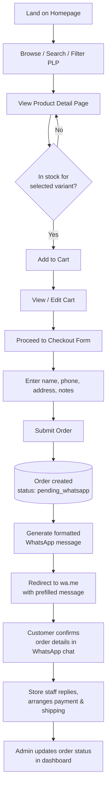
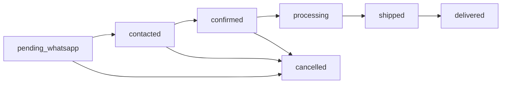
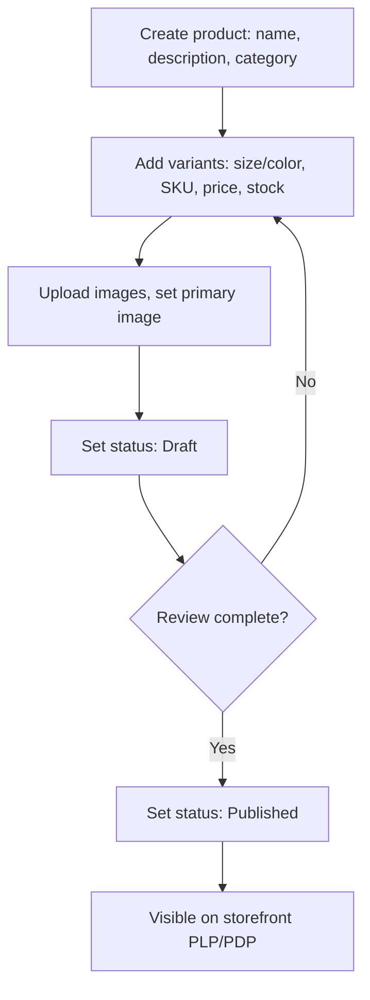

# Fashion E-Commerce Platform — Product Requirements Document (PRD)

**Version:** 1.0
**Date:** July 30, 2026
**Status:** Draft for review

---

## 1. Executive Summary

We are building a modern, mobile-first fashion e-commerce platform consisting of:

1. A **customer storefront** where shoppers browse a fashion catalog, filter/search products, and check out.
2. A **WhatsApp-based checkout flow** — instead of a payment gateway, the system generates a pre-filled, formatted order message and redirects the customer to WhatsApp to complete the transaction with the store directly. This suits markets where WhatsApp Business is the dominant commerce channel and removes the cost/complexity of PCI compliance and gateway integration for v1.
3. An **admin dashboard** giving store staff full control over catalog, orders, customers, marketing content, and store configuration.

The platform is built on **Vue.js 3 (latest stable)** for the frontend and **PostgreSQL** for the primary datastore, with a decoupled REST API backend (see `technical-architecture.md` for full stack rationale).

---

## 2. Goals & Success Metrics

**Business goals**
- Launch a self-serve online storefront that reduces reliance on manual WhatsApp/Instagram order-taking.
- Give non-technical staff full control of catalog, content, and orders without developer involvement.
- Keep checkout friction low by meeting customers where they already transact (WhatsApp).
- Build a foundation that can later support payment gateways, multi-vendor, and loyalty features without a rewrite.

**Success metrics**

| Metric | Target (first 3 months post-launch) |
|---|---|
| Storefront → WhatsApp checkout conversion rate | ≥ 3–5% of sessions |
| Cart abandonment (added to cart, never reached checkout) | < 65% |
| Admin time to publish a new product | < 3 minutes |
| Mobile Lighthouse performance score (storefront) | ≥ 85 |
| Order processing time (pending → confirmed) | < 24 hours |
| Page load (LCP) on product listing | < 2.5s on 4G |

---

## 3. Scope

**In scope (v1)**
- Storefront: Home, About, Contact, PLP, PDP, Cart, WhatsApp Checkout
- Admin: Dashboard/analytics, products, categories, inventory, orders, customers, banners/homepage content, discounts, settings, contact messages, users/roles, activity logs
- Guest checkout only (no mandatory customer accounts for v1 — see open question below)
- Single currency, single language (configurable, not multi-locale in v1)
- Single vendor (the store itself)

**Out of scope (v1, planned for later — see §13)**
- Payment gateway integration (Stripe/Midtrans/Xendit etc.)
- Multi-vendor marketplace functionality
- Native mobile apps
- Multi-language / multi-currency
- Product reviews (schema will be designed in v1 so it can be turned on later with minimal migration)

**Open product decision to confirm with stakeholders:** whether customers must register/log in to check out, or whether guest checkout (name/phone/address captured at checkout) is sufficient for v1. This PRD assumes **guest checkout by default, with optional account creation** so returning customers can view order history — flag this if you want it locked to one or the other.

---

## 4. User Personas

### Customer personas

| Persona | Profile | Goals | Pain points | Notes |
|---|---|---|---|---|
| **Dinda, 22 — Trend-driven student** | Mobile-only, price-sensitive, follows the brand on Instagram/TikTok | Discover new drops fast, filter by size/price, checkout with minimal friction | Slow sites, forced account creation, unclear stock/size availability | Primary persona — design mobile-first for her |
| **Raka, 29 — Busy young professional** | Shops on desktop during work breaks or mobile in the evening | Find specific items quickly (search + filters), trust the brand, get quick confirmation | Doesn't want to "chat" for basic info; wants clear pricing/stock before messaging | Needs the PDP to answer 90% of questions before WhatsApp |
| **Sari, 35 — Repeat/loyal customer** | Has ordered before via Instagram DM, values relationship with the brand | Reorder easily, track order status, ask questions comfortably over WhatsApp | Losing track of past orders, unclear how to follow up | Benefits from optional account + order history |

### Admin personas

| Persona | Role | Goals | Pain points |
|---|---|---|---|
| **Store Owner / Manager** | Full access | See sales performance at a glance, manage promotions, oversee staff | Needs a dashboard, not raw data; wants control over discounts/banners without dev help |
| **Catalog & Inventory Staff** | Product-focused role | Add/edit products quickly, keep stock accurate, organize categories | Repetitive data entry; needs bulk-friendly UI and clear variant (size/color) management |
| **Customer Support / Order Processor** | Order-focused role | Move orders through the fulfillment pipeline, respond to contact form messages | Needs a clear order status pipeline synced with what's happening on WhatsApp |

---

## 5. Functional Requirements

Priority key: **M** = Must have (v1), **S** = Should have (v1), **C** = Could have (later).

### 5.1 Customer-Facing

| ID | Requirement | Priority |
|---|---|---|
| FR-C-01 | Homepage displays hero/promo banners, featured products, featured collections, and brand highlights, all editable from admin | M |
| FR-C-02 | About page renders CMS-editable brand story content | M |
| FR-C-03 | Contact page shows store info (address, phone, email, socials, map) and a contact form | M |
| FR-C-04 | Contact form submissions are stored and visible in admin; confirmation shown to user on submit | M |
| FR-C-05 | Product Listing Page supports category filter, price range filter, size filter, color filter, combinable simultaneously | M |
| FR-C-06 | PLP sorting: Newest, Best Selling, Price Low→High, Price High→Low | M |
| FR-C-07 | PLP keyword search (name, description, SKU, tags) | M |
| FR-C-08 | PLP pagination (page-based, SEO-friendly URLs); "Load more" pattern as UX-friendly alternative to infinite scroll | M |
| FR-C-09 | Product Detail Page: image gallery (multiple images, zoom), description, size/color selector, live stock status per variant, quantity selector | M |
| FR-C-10 | PDP shows "related products" (same category/collection) | M |
| FR-C-11 | PDP reviews section — schema present in v1, UI can be feature-flagged off until enabled | S |
| FR-C-12 | Add to cart with selected variant + quantity; validation against available stock | M |
| FR-C-13 | Cart page: update quantity, remove item, view subtotal, persists across session (guest cart via local storage/cookie token, merged into account cart if user logs in) | M |
| FR-C-14 | Checkout form collects name, phone (required, validated), email (optional), shipping address, order notes | M |
| FR-C-15 | On submit, system creates an Order record (status `pending_whatsapp`), generates a formatted order summary message, URL-encodes it, and redirects to `https://wa.me/<store_number>?text=...` | M |
| FR-C-16 | Order confirmation screen shown before/alongside WhatsApp redirect, summarizing what was sent, with an order reference number | M |
| FR-C-17 | Optional customer account: register/login, view past orders, saved addresses | S |
| FR-C-18 | Responsive design across mobile/tablet/desktop; mobile-first | M |
| FR-C-19 | Out-of-stock variants are visibly disabled, not just hidden | M |

### 5.2 Admin Dashboard

| ID | Requirement | Priority |
|---|---|---|
| FR-A-01 | Dashboard home: revenue (day/week/month), order count, new customers, low-stock alerts, top-selling products, sales trend chart | M |
| FR-A-02 | Sales reporting: filterable by date range, category, product; exportable (CSV) | S |
| FR-A-03 | Product CRUD: name, description, category, base price, variants (size/color combinations with individual SKU/price-override/stock), images, status (draft/published/archived) | M |
| FR-A-04 | Bulk actions on products (publish, archive, delete) | S |
| FR-A-05 | Category management: create/edit/delete, nested categories, category images | M |
| FR-A-06 | Inventory management: per-variant stock levels, manual adjustment with reason/audit trail, low-stock threshold alerts | M |
| FR-A-07 | Order management: list with filters (status, date, customer), detail view, status pipeline update, internal notes, resend/copy WhatsApp message | M |
| FR-A-08 | Customer management: list, profile (contact info, order history, total spend), manual notes/tags | M |
| FR-A-09 | Banner/homepage content management: hero banners (image, link, schedule start/end), featured collections/products selection, drag-reorder | M |
| FR-A-10 | Discount/promotion management: percentage or fixed discounts, code-based or automatic, usage limits, date ranges, min. order value | S |
| FR-A-11 | Website settings: store info, WhatsApp number, social links, SEO defaults (meta title/description), shipping notes, currency/locale, tax display | M |
| FR-A-12 | Contact message inbox: list, mark read/unread/replied, respond via WhatsApp/email link | M |
| FR-A-13 | User & role management: invite admin users, assign roles (Owner, Manager, Staff, Support) with granular permissions | M |
| FR-A-14 | Activity log: who changed what and when (product edits, order status changes, settings changes, user management actions) | M |
| FR-A-15 | Admin authentication with secure session/JWT, password reset, optional 2FA | M |
| FR-A-16 | Admin search (global search across products/orders/customers) | S |

---

## 6. Non-Functional Requirements

| Category | Requirement |
|---|---|
| **Performance** | Storefront LCP < 2.5s on 4G; API p95 response time < 300ms for catalog reads; images served via CDN with responsive `srcset` |
| **Scalability** | Stateless API layer, horizontally scalable; database indexed for catalog filtering at 50k+ SKUs; caching layer (Redis) for hot catalog reads |
| **Availability** | Target 99.5% uptime for storefront; graceful degradation if WhatsApp deep link fails (show manual fallback with copyable message + number) |
| **Security** | HTTPS everywhere; hashed passwords (Argon2/bcrypt); RBAC for admin; input validation/sanitization; rate limiting on public endpoints; CSRF/XSS protections; signed/expiring URLs for uploaded media if private |
| **Accessibility** | WCAG 2.1 AA target for storefront: semantic HTML, keyboard navigation, alt text fields for all product images, color-contrast compliant design tokens |
| **SEO** | Server-rendered or statically-rendered storefront pages (product/category pages crawlable), structured data (schema.org `Product`), canonical URLs, sitemap.xml, per-page meta tags editable from admin |
| **Maintainability** | Typed codebase (TypeScript across frontend + backend), documented API (OpenAPI spec), consistent linting/formatting, modular folder structure, automated tests on critical flows |
| **Auditability** | All admin mutations logged with actor, timestamp, before/after diff where feasible |
| **Data privacy** | Customer PII (phone, address) stored encrypted at rest where supported by the DB/host; access limited by role; clear data retention policy for contact form submissions |
| **Compliance** | WhatsApp Business API/click-to-chat usage complies with WhatsApp's commerce policies (no unsolicited messaging — checkout only opens a chat the customer initiates) |
| **Internationalization readiness** | Even though v1 is single-locale, currency/text values are not hardcoded, to ease future localization |

---

## 7. User Stories

Format: *As a [persona], I want to [do something], so that [benefit].*

### Epic: Browsing & Discovery
- As **Dinda**, I want to filter products by size and price, so that I only see items I can actually afford and wear.
  - *Acceptance:* Filters are combinable; filtered results update without full page reload; active filters are shown as removable chips; filter state reflected in the URL (shareable/bookmarkable, SEO-friendly).
- As **Raka**, I want to search by keyword, so that I can find a specific item fast instead of browsing categories.
  - *Acceptance:* Search matches product name, description, and SKU; empty results show a helpful "no results" state with suggestions.
- As a shopper, I want to sort by price or newest, so that I can shop according to my priorities.

### Epic: Product Detail
- As **Raka**, I want to see live stock per size/color, so that I don't pick something unavailable.
  - *Acceptance:* Selecting a size/color that's out of stock disables "Add to Cart" and shows "Out of stock" clearly.
- As a shopper, I want to see related products, so that I can discover more items I might like.

### Epic: Cart & Checkout
- As **Dinda**, I want to review and edit my cart before checkout, so that I don't order the wrong quantity/size.
- As **Dinda**, I want to complete checkout by sending an order through WhatsApp, so that I can finalize payment/shipping directly with the store the way I already do on Instagram.
  - *Acceptance:* Submitting checkout creates an order record with status `pending_whatsapp`; a correctly formatted message (items, variants, quantities, subtotal, order number, customer info) is generated and URL-encoded; the customer is redirected to `wa.me` with the store's number; if redirect fails (e.g., desktop without WhatsApp), a fallback screen shows the message text with a "copy" button and the WhatsApp link.
- As **Sari**, I want to see my past orders when logged in, so that I can reorder easily.

### Epic: Admin — Catalog
- As **Catalog Staff**, I want to add a product with multiple size/color variants and per-variant stock, so that customers see accurate availability.
  - *Acceptance:* Each variant has its own SKU, stock count, optional price override, and can be individually enabled/disabled; at least one variant required to publish.
- As **Catalog Staff**, I want low-stock alerts, so that I can restock before items sell out.

### Epic: Admin — Orders
- As **Order Processor**, I want to see all orders in a pipeline (pending → contacted → confirmed → processing → shipped → delivered / cancelled), so that nothing falls through the cracks.
  - *Acceptance:* Status changes are logged with actor and timestamp; filtering by status and date range; clicking an order shows the exact WhatsApp message that was generated for reference.
- As **Store Owner**, I want a sales dashboard, so that I can track performance without pulling manual reports.

### Epic: Admin — Marketing & Content
- As **Store Owner**, I want to update homepage banners and featured products myself, so that I don't need a developer for every promotion.
- As **Store Owner**, I want to create discount codes with usage limits and date ranges, so that I can run time-boxed campaigns.

### Epic: Admin — Access Control
- As **Store Owner**, I want to invite staff with limited roles (e.g., Catalog Staff can't edit discounts), so that I can delegate safely.
- As **Store Owner**, I want an activity log, so that I can audit who changed what.

---

## 8. Customer Workflow — Browse to WhatsApp Checkout



---

## 9. Admin Workflows

### 9.1 Order fulfillment



Each transition is triggered manually by an admin/support user after the corresponding real-world event (e.g., moving to `confirmed` once payment is verified over WhatsApp). Every transition is written to the activity log.

### 9.2 Product publishing



---

## 10. UI/UX Planning

### 10.1 Sitemap

```
Storefront
├── / (Home)
├── /about
├── /contact
├── /products (PLP)
│   └── /products/[slug] (PDP)
├── /categories/[slug]
├── /cart
├── /checkout
├── /order/confirmation/[orderNumber]
├── /account (optional, if logged in)
│   ├── /account/orders
│   └── /account/addresses
└── /login, /register

Admin
├── /admin/login
├── /admin/dashboard
├── /admin/products
├── /admin/categories
├── /admin/inventory
├── /admin/orders
├── /admin/customers
├── /admin/content/banners
├── /admin/marketing/discounts
├── /admin/messages
├── /admin/settings
├── /admin/users
└── /admin/activity-logs
```

### 10.2 Design principles
- **Mobile-first**, since the primary persona shops on a phone.
- **Photography-led**: large, high-quality product imagery is the main visual language; UI chrome stays minimal and out of the way.
- **Fast perceived performance**: skeleton loaders on PLP/PDP, optimistic cart updates.
- **Low-friction checkout**: as few form fields as possible before handing off to WhatsApp.
- **Editorial homepage**: banners/collections feel like a lookbook, not a generic template.

### 10.3 Responsive breakpoints (Tailwind defaults, recommended)

| Breakpoint | Width | Primary use |
|---|---|---|
| `sm` | 640px | Large phones |
| `md` | 768px | Tablets |
| `lg` | 1024px | Small laptops — PLP switches to multi-column with sidebar filters |
| `xl` | 1280px | Desktop |
| `2xl` | 1536px | Large desktop |

### 10.4 Design system basics
- **Typography:** one editorial/serif or distinctive display font for headings (brand personality), one clean sans-serif for body/UI text.
- **Color:** neutral base palette (off-white/black/greys) with a single accent color reserved for CTAs, sale tags, and status indicators — lets product photography carry the color.
- **Spacing scale:** 4px base unit (Tailwind default) for consistency.
- **Core components:** Button, Input, Select, Badge/Tag, ProductCard, FilterAccordion, ImageGallery/Zoom, QuantityStepper, Toast/Notification, Modal/Drawer (cart, filters on mobile), Table (admin), StatusPill (order status), StatCard (dashboard).

### 10.5 Key page composition (v1)

- **Homepage:** Hero banner carousel → Featured collections grid → Best sellers/new arrivals rail → Brand story teaser → Instagram/social proof strip → Newsletter/contact CTA → Footer.
- **PLP:** Sticky filter sidebar (drawer on mobile) → Sort dropdown + result count → Responsive product grid (2 cols mobile / 3–4 desktop) → Pagination or "Load more".
- **PDP:** Sticky/scrollable image gallery (left) → Product info panel (right): name, price, size/color selectors, stock status, quantity, Add to Cart, accordion for description/shipping/returns → Related products rail below.
- **Cart:** Line items with thumbnail, variant, quantity stepper, remove → Order summary (subtotal, note that shipping is arranged via WhatsApp) → Checkout CTA.
- **Checkout:** Single-page form (contact info, shipping address, notes) → Order summary recap → "Send Order via WhatsApp" primary CTA.
- **Admin dashboard home:** KPI stat cards row → Sales trend chart → Recent orders table → Low-stock alert panel.

---

## 11. Development Roadmap

| Phase | Focus | Key deliverables | Est. duration |
|---|---|---|---|
| **0. Foundation** | Project setup | Monorepo scaffold, CI/CD, DB schema + migrations, auth (customer + admin), design tokens | 1–2 weeks |
| **1. Storefront MVP** | Core shopping experience | Home, About, Contact, PLP with filters/search/sort, PDP, Cart | 3–4 weeks |
| **2. WhatsApp Checkout** | Core conversion flow | Checkout form, order creation, message generation, `wa.me` redirect, order confirmation page, fallback UX | 1–2 weeks |
| **3. Admin Core** | Store operability | Auth/roles, product CRUD, category management, inventory, order pipeline, customer list | 3–4 weeks |
| **4. Admin Advanced** | Marketing & ops | Dashboard analytics, banners/homepage content, discounts, settings, contact inbox, activity logs | 2–3 weeks |
| **5. Hardening & QA** | Production readiness | Accessibility pass, performance tuning, security review, cross-browser/device QA, load testing | 1–2 weeks |
| **6. Launch** | Go-live | Domain/hosting cutover, monitoring/alerting live, staff training | 1 week |
| **7. Post-launch** | Iterate | Reviews, wishlist, loyalty/coupons, analytics deepening, PWA (see §13) | Ongoing |

*(Estimates assume a small focused team — 1–2 full-stack developers and 1 designer; adjust to actual team size.)*

---

## 12. Best Practices

**Scalability**
- Stateless backend services behind a load balancer; horizontal scaling for the API tier.
- Redis cache for hot catalog queries (category listings, homepage content) with sensible TTLs and cache-busting on admin writes.
- Database indexes on all filter/sort columns (category, price, size, color, created_at, sales count); composite indexes for common filter combinations.
- Paginate everything server-side; never return unbounded result sets.
- Move heavy/async work (image resizing, email sending, report generation) to a background job queue rather than the request/response cycle.

**Maintainability**
- TypeScript end-to-end (frontend + backend) with shared type definitions for API contracts.
- OpenAPI/Swagger spec generated from the backend as the single source of truth for the API.
- Enforce linting/formatting (ESLint + Prettier) and commit hooks (lint-staged/Husky).
- Component-driven UI development with a documented design system (Storybook recommended).
- Automated tests: unit tests for business logic (pricing, stock, discount calculation), integration tests for API endpoints, E2E tests (Playwright) for the checkout flow and critical admin flows.
- Feature flags for features shipped early but not yet public (e.g., reviews).

**Security**
- Principle of least privilege for admin roles; every admin mutation checked against RBAC permissions server-side (never trust the frontend).
- Parameterized queries / ORM usage only — no raw string-concatenated SQL.
- Rate-limit public endpoints (search, contact form, checkout submission) to prevent abuse.
- Validate and sanitize all inputs server-side (never rely solely on frontend validation).
- Store secrets (DB credentials, JWT signing keys, S3 keys) in environment variables / a secrets manager, never in source control.
- Enforce HTTPS, secure cookies (`HttpOnly`, `Secure`, `SameSite`), and CSRF protection on state-changing admin requests.
- Regularly patch dependencies; run automated dependency vulnerability scanning in CI.

---

## 13. Future Feature Recommendations

| Feature | Value | Notes |
|---|---|---|
| **Product reviews & ratings** | Builds trust, improves conversion | Schema included in v1 DB design; ship UI behind a flag |
| **Wishlist / Save for later** | Increases return visits | Simple join table; works for guest (local storage) and logged-in users |
| **Coupons & loyalty program** | Repeat purchase incentive | Discount engine in v1 can extend to tiered/loyalty rules |
| **Deeper analytics** | Better business decisions | Funnel analysis (view → add to cart → checkout started → WhatsApp sent), cohort retention, product performance |
| **Multi-vendor marketplace** | Business model expansion | Significant schema/architecture change — plan as a distinct major version, not a bolt-on |
| **Payment gateway integration** | Reduce manual payment confirmation | Add as an alternative checkout path alongside WhatsApp, not a replacement |
| **Abandoned cart recovery via WhatsApp** | Recover lost sales | Requires WhatsApp Business API (not just click-to-chat) and opt-in consent |
| **PWA / installable storefront** | Better repeat mobile engagement | Natural fit given mobile-first design |
| **Multi-language & multi-currency** | Market expansion | Plan content/i18n structure early even if not enabled at launch |
| **Size guide / virtual try-on** | Reduce returns, aid sizing decisions | Start with a simple size chart; AR try-on is a later, higher-effort investment |

---

*See `technical-architecture.md` for the system architecture, database schema (ERD + SQL), REST API specification, recommended tech stack, and folder structure.*
