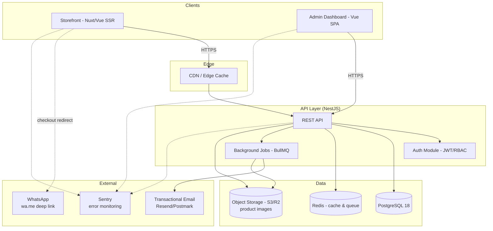
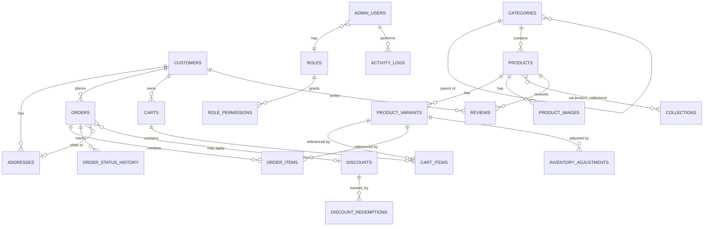

# Technical Architecture & System Design
## Fashion E-Commerce Platform

**Companion document to `PRD.md`.**

---

## 1. Recommended Technology Stack

A monorepo, TypeScript-everywhere stack is recommended so the storefront, admin panel, and API share types and tooling.

| Layer | Recommendation | Why |
|---|---|---|
| **Storefront frontend** | **Nuxt 4.x** (built on **Vue 3.5**, latest stable) | The storefront needs SEO (product pages must be crawlable) and fast first paint. Nuxt gives Vue 3 + SSR/SSG/ISR out of the box, file-based routing, and image optimization modules — without leaving the Vue ecosystem. Nuxt 3 reaches end-of-life on July 31, 2026, so Nuxt 4 is the correct default for any new project now. *(If SEO isn't a priority for you, a plain Vue 3 + Vite SPA is a valid simpler alternative — flagged below.)* |
| **Admin dashboard frontend** | **Vue 3.5 + Vite** (SPA, no SSR needed) | Admin doesn't need SEO; a lighter SPA build keeps tooling simple and fast to develop. |
| **State management** | **Pinia** | Official Vue state library, TypeScript-friendly, replaces Vuex. |
| **Data fetching / caching** | **TanStack Query (Vue Query)** (or Nuxt's built-in `useFetch`/`useAsyncData` in Nuxt) | Handles caching, retries, and loading/error state for API calls. |
| **Styling** | **Tailwind CSS 4** | Utility-first, fast to build a distinctive design system with (see `frontend-design` guidance for avoiding generic look). |
| **UI component base (admin)** | **shadcn-vue** or **PrimeVue** for data-heavy admin components (tables, date pickers) | Saves significant time building CRUD-heavy admin UI. |
| **Forms & validation** | **VeeValidate + Zod** | Type-safe schema validation shared between frontend and backend where possible. |
| **Backend runtime** | **Node.js 24 LTS** | Currently the active LTS line (Node 22 is in maintenance-only mode; Node 26 is the newer "Current" release but doesn't enter LTS until October 2026). Matches the TypeScript-everywhere strategy; large ecosystem. |
| **Backend framework** | **NestJS 11.x** | Opinionated, modular, TypeScript-first — scales well for a "comprehensive admin panel + storefront API" with many resources (products, orders, discounts, RBAC, etc.). Built-in support for guards (RBAC), pipes (validation), interceptors (logging/activity log), and OpenAPI generation. *(NestJS 12 is in active development with an ESM-first rewrite, targeted for Q3 2026 — worth watching but not yet stable.)* |
| **ORM** | **Prisma ORM 7.x** | Type-safe queries, first-class PostgreSQL support, easy migrations, great DX for a schema this relational. *(A TypeScript-rewritten "Prisma Next" is in early access as the future v8 — not yet recommended for production; stick with the stable 7.x line.)* |
| **Primary database** | **PostgreSQL 18** | As requested — strong relational integrity for orders/inventory, JSONB for flexible fields (settings, product attributes), full-text search support. *(PostgreSQL 19 is in beta as of this writing, targeting a Sept/Oct 2026 GA — not yet recommended for production.)* |
| **Cache / queues** | **Redis 8.x + BullMQ** | Cache hot catalog reads; background jobs (image processing, email sending, scheduled banner activation, activity log writes). *(Note: Redis 8.0+ moved to a source-available tri-license — RSALv2/SSPLv1/AGPLv3 — rather than the old BSD license. This is generally not an issue for using Redis as infrastructure inside your own app, but if that matters to you, **Valkey** — the Linux Foundation's BSD-licensed Redis fork — is a drop-in alternative.)* |
| **Auth** | **JWT (access + refresh tokens)**, Argon2 password hashing, RBAC via NestJS guards | Stateless auth suits a decoupled SPA/API architecture; refresh tokens stored as httpOnly cookies. |
| **File/image storage** | **Cloudflare R2** or **AWS S3** + CDN (Cloudflare CDN / CloudFront) | Product images are the core asset; keep them off the app server, served via CDN with resizing (via `sharp` in a background job, or a service like Cloudinary/imgix if budget allows). |
| **Search** | **PostgreSQL full-text search + `pg_trgm`** for v1; **Meilisearch** or **Typesense** if catalog grows large or fuzzy/typo-tolerant search becomes important | Avoid the operational overhead of a separate search service until it's actually needed. |
| **Transactional email** | **Resend** or **Postmark** | Order confirmation emails (if email captured), contact form auto-reply, admin invite emails. |
| **Monitoring / errors** | **Sentry** (frontend + backend) | Error tracking across both apps. |
| **Product analytics** | **PostHog** or **GA4** | Funnel tracking (browse → cart → WhatsApp sent). |
| **Testing** | **Vitest** (unit), **Playwright** (E2E) | Playwright covers the critical checkout → WhatsApp redirect flow end-to-end. |
| **CI/CD** | **GitHub Actions** | Lint/test/build on PR, deploy on merge. |
| **Containerization** | **Docker + Docker Compose** | Local dev parity (Postgres, Redis, API together); also usable for self-hosted production deploys. |
| **Hosting — storefront** | **Vercel** or **Cloudflare Pages** (Nuxt-optimized) | Zero-config SSR hosting, global edge CDN. |
| **Hosting — admin** | Same host as API, or a static host (it's a SPA) behind auth | Simpler ops if bundled with the API deploy. |
| **Hosting — API** | **Railway**, **Render**, or **Fly.io** for managed simplicity; or a **VPS with Docker Compose + Nginx** for full control/cost efficiency at scale | Pick managed for speed-to-launch; self-host later if cost/control matters. |
| **Hosting — database** | **Neon** or **Supabase** (managed Postgres, generous free tiers, branching for dev) or **AWS RDS** for enterprise needs | Managed Postgres removes a major ops burden. |

### Why not a payment gateway / why not GraphQL?
- **Payment gateway:** intentionally out of scope per the PRD — WhatsApp checkout replaces it for v1. The schema and API are designed so a gateway can be *added* later as an alternate checkout path.
- **API style — REST vs GraphQL vs tRPC:** **REST is recommended.** The domain here (products, orders, categories, etc.) maps cleanly to resources, the API needs to be consumed by two separate frontends (storefront + admin) with different needs but no extreme over/under-fetching problems, and REST keeps the OpenAPI spec simple to document and version. **tRPC** is a reasonable alternative *only if* you commit to a single TypeScript monorepo end-to-end and don't anticipate third-party API consumers — it trades broad interoperability for even tighter type-safety. GraphQL is not recommended here: its main benefits (flexible querying, avoiding over-fetching across many client shapes) aren't strongly needed for two known, well-defined frontends, and it adds real complexity (resolver design, N+1 query management, caching complexity) that outweighs the benefit at this scope.

### Simpler alternative stack (if you want to reduce moving parts)
If SSR/SEO nuance isn't worth the added complexity to you, or you want a smaller learning curve:
- Storefront: **Vue 3 + Vite SPA** with **`vite-plugin-ssr`** or pre-rendering only the marketing pages (Home/About) for SEO, and accept that PLP/PDP are client-rendered (weaker SEO).
- Backend: plain **Express + TypeScript** instead of NestJS if you find Nest's structure heavier than you need — Prisma + Postgres stay the same either way.

---

## 2. System Architecture Diagram



**Flow notes**
- Storefront and admin are two separate deployable apps, both consuming the same REST API — never talking to Postgres directly.
- The WhatsApp "integration" is not a server-to-server API call; it's a client-side redirect to a `wa.me` deep link built from data the API already returned (order number + generated message). No WhatsApp Business API credentials are required for v1.
- Redis serves two purposes: response caching (catalog reads) and as the backing store for the BullMQ job queue (emails, image processing, log writes).

---

## 3. Recommended Folder / Project Structure

**Monorepo (pnpm workspaces or Turborepo)**

```
fashion-store/
├── apps/
│   ├── storefront/                 # Nuxt 4 app
│   │   ├── assets/
│   │   ├── components/
│   │   │   ├── product/
│   │   │   ├── cart/
│   │   │   ├── checkout/
│   │   │   └── layout/
│   │   ├── composables/            # useCart, useProducts, useCheckout...
│   │   ├── layouts/
│   │   ├── pages/                  # file-based routing
│   │   │   ├── index.vue
│   │   │   ├── about.vue
│   │   │   ├── contact.vue
│   │   │   ├── products/
│   │   │   │   ├── index.vue
│   │   │   │   └── [slug].vue
│   │   │   ├── cart.vue
│   │   │   └── checkout.vue
│   │   ├── stores/                 # Pinia stores: cart, session
│   │   ├── public/
│   │   └── nuxt.config.ts
│   │
│   ├── admin/                      # Vue 3 + Vite SPA
│   │   ├── src/
│   │   │   ├── components/
│   │   │   ├── views/
│   │   │   │   ├── dashboard/
│   │   │   │   ├── products/
│   │   │   │   ├── categories/
│   │   │   │   ├── inventory/
│   │   │   │   ├── orders/
│   │   │   │   ├── customers/
│   │   │   │   ├── content/        # banners/homepage
│   │   │   │   ├── marketing/      # discounts
│   │   │   │   ├── messages/
│   │   │   │   ├── settings/
│   │   │   │   ├── users/
│   │   │   │   └── activity-logs/
│   │   │   ├── router/
│   │   │   ├── stores/             # Pinia: auth, ui
│   │   │   ├── api/                # typed API client
│   │   │   └── main.ts
│   │   └── vite.config.ts
│   │
│   └── api/                        # NestJS app
│       ├── src/
│       │   ├── modules/
│       │   │   ├── auth/
│       │   │   ├── users/          # admin users, roles, permissions
│       │   │   ├── customers/
│       │   │   ├── products/
│       │   │   ├── categories/
│       │   │   ├── collections/
│       │   │   ├── inventory/
│       │   │   ├── cart/
│       │   │   ├── orders/
│       │   │   ├── discounts/
│       │   │   ├── banners/
│       │   │   ├── contact-messages/
│       │   │   ├── settings/
│       │   │   ├── activity-log/
│       │   │   └── analytics/
│       │   ├── common/
│       │   │   ├── guards/         # RBAC, JWT
│       │   │   ├── interceptors/   # activity logging
│       │   │   ├── decorators/
│       │   │   └── filters/        # exception handling
│       │   ├── jobs/                # BullMQ processors
│       │   ├── prisma/
│       │   │   ├── schema.prisma
│       │   │   └── migrations/
│       │   └── main.ts
│       └── test/
│
├── packages/
│   ├── shared-types/                # DTOs / API contract types shared across apps
│   └── ui/                          # (optional) shared Vue component primitives
│
├── docker-compose.yml                # postgres, redis, api (local dev)
├── turbo.json
├── package.json
└── .github/workflows/                # CI/CD pipelines
```

---

## 4. Database Design — ERD



**Entity summary**

| Entity | Purpose |
|---|---|
| `customers` | Storefront accounts (optional — guest checkout also supported via snapshot fields on `orders`) |
| `addresses` | Reusable shipping addresses per customer |
| `categories` | Hierarchical product categories |
| `collections` | Curated groupings (e.g. "Summer Drop") independent of category tree |
| `products` | Core product record |
| `product_variants` | Size/color combinations, each with its own SKU, stock, optional price override |
| `product_images` | Gallery images per product (and optionally per variant) |
| `carts` / `cart_items` | Guest or account cart |
| `orders` / `order_items` | Order header + line items; snapshots product/price at time of order |
| `order_status_history` | Audit trail of status transitions |
| `discounts` / `discount_redemptions` | Promotional codes/auto-discounts and their usage |
| `banners` | Homepage/marketing banners with scheduling |
| `contact_messages` | Contact form submissions |
| `admin_users` / `roles` / `role_permissions` | Admin accounts and RBAC |
| `activity_logs` | Audit log of admin actions |
| `reviews` | Product reviews (schema ready in v1, feature-flagged) |
| `settings` | Key-value store for store configuration |

---

## 5. PostgreSQL Schema (DDL)

```sql
-- ============================================================
-- EXTENSIONS
-- ============================================================
CREATE EXTENSION IF NOT EXISTS "pgcrypto";   -- for gen_random_uuid()
CREATE EXTENSION IF NOT EXISTS pg_trgm;      -- fuzzy/full-text search

-- ============================================================
-- ENUM TYPES
-- ============================================================
CREATE TYPE product_status AS ENUM ('draft', 'published', 'archived');
CREATE TYPE order_status AS ENUM (
    'pending_whatsapp', 'contacted', 'confirmed',
    'processing', 'shipped', 'delivered', 'cancelled'
);
CREATE TYPE discount_type AS ENUM ('percentage', 'fixed_amount');
CREATE TYPE contact_message_status AS ENUM ('unread', 'read', 'replied');
CREATE TYPE banner_placement AS ENUM ('hero', 'promo_strip', 'category_page');

-- ============================================================
-- ADMIN / RBAC
-- ============================================================
CREATE TABLE roles (
    id              UUID PRIMARY KEY DEFAULT gen_random_uuid(),
    name            VARCHAR(50) UNIQUE NOT NULL,        -- Owner, Manager, Staff, Support
    description     TEXT,
    created_at      TIMESTAMPTZ NOT NULL DEFAULT now()
);

CREATE TABLE permissions (
    id              UUID PRIMARY KEY DEFAULT gen_random_uuid(),
    code            VARCHAR(100) UNIQUE NOT NULL,        -- e.g. 'products.write'
    description     TEXT
);

CREATE TABLE role_permissions (
    role_id         UUID NOT NULL REFERENCES roles(id) ON DELETE CASCADE,
    permission_id   UUID NOT NULL REFERENCES permissions(id) ON DELETE CASCADE,
    PRIMARY KEY (role_id, permission_id)
);

CREATE TABLE admin_users (
    id              UUID PRIMARY KEY DEFAULT gen_random_uuid(),
    name            VARCHAR(150) NOT NULL,
    email           VARCHAR(255) UNIQUE NOT NULL,
    password_hash   VARCHAR(255) NOT NULL,
    role_id         UUID NOT NULL REFERENCES roles(id),
    is_active       BOOLEAN NOT NULL DEFAULT true,
    two_factor_enabled BOOLEAN NOT NULL DEFAULT false,
    last_login_at   TIMESTAMPTZ,
    created_at      TIMESTAMPTZ NOT NULL DEFAULT now(),
    updated_at      TIMESTAMPTZ NOT NULL DEFAULT now()
);

-- ============================================================
-- CUSTOMERS
-- ============================================================
CREATE TABLE customers (
    id              UUID PRIMARY KEY DEFAULT gen_random_uuid(),
    name            VARCHAR(150) NOT NULL,
    email           VARCHAR(255) UNIQUE,
    phone           VARCHAR(30) NOT NULL,
    password_hash   VARCHAR(255),                 -- null = guest-only, never registered
    is_guest        BOOLEAN NOT NULL DEFAULT true,
    created_at      TIMESTAMPTZ NOT NULL DEFAULT now(),
    updated_at      TIMESTAMPTZ NOT NULL DEFAULT now()
);
CREATE INDEX idx_customers_phone ON customers(phone);

CREATE TABLE addresses (
    id              UUID PRIMARY KEY DEFAULT gen_random_uuid(),
    customer_id     UUID NOT NULL REFERENCES customers(id) ON DELETE CASCADE,
    label           VARCHAR(50),                  -- 'Home', 'Office'
    recipient_name  VARCHAR(150) NOT NULL,
    phone           VARCHAR(30) NOT NULL,
    line1           VARCHAR(255) NOT NULL,
    line2           VARCHAR(255),
    city            VARCHAR(100) NOT NULL,
    province        VARCHAR(100),
    postal_code     VARCHAR(20),
    country         VARCHAR(100) NOT NULL DEFAULT 'Indonesia',
    is_default      BOOLEAN NOT NULL DEFAULT false,
    created_at      TIMESTAMPTZ NOT NULL DEFAULT now()
);

-- ============================================================
-- CATALOG
-- ============================================================
CREATE TABLE categories (
    id              UUID PRIMARY KEY DEFAULT gen_random_uuid(),
    parent_id       UUID REFERENCES categories(id) ON DELETE SET NULL,
    name            VARCHAR(100) NOT NULL,
    slug            VARCHAR(120) UNIQUE NOT NULL,
    image_url       TEXT,
    description     TEXT,
    display_order   INT NOT NULL DEFAULT 0,
    is_active       BOOLEAN NOT NULL DEFAULT true,
    created_at      TIMESTAMPTZ NOT NULL DEFAULT now()
);
CREATE INDEX idx_categories_parent ON categories(parent_id);

CREATE TABLE collections (
    id              UUID PRIMARY KEY DEFAULT gen_random_uuid(),
    name            VARCHAR(150) NOT NULL,
    slug            VARCHAR(170) UNIQUE NOT NULL,
    description     TEXT,
    banner_image_url TEXT,
    is_active       BOOLEAN NOT NULL DEFAULT true,
    created_at      TIMESTAMPTZ NOT NULL DEFAULT now()
);

CREATE TABLE products (
    id              UUID PRIMARY KEY DEFAULT gen_random_uuid(),
    category_id     UUID REFERENCES categories(id) ON DELETE SET NULL,
    name            VARCHAR(200) NOT NULL,
    slug            VARCHAR(220) UNIQUE NOT NULL,
    description     TEXT,
    base_price      NUMERIC(12,2) NOT NULL CHECK (base_price >= 0),
    status          product_status NOT NULL DEFAULT 'draft',
    sku_prefix      VARCHAR(30),
    meta_title      VARCHAR(200),
    meta_description VARCHAR(300),
    sales_count     INT NOT NULL DEFAULT 0,          -- denormalized, updated on order confirm
    attributes      JSONB DEFAULT '{}',               -- flexible extra attrs (material, fit, etc.)
    created_at      TIMESTAMPTZ NOT NULL DEFAULT now(),
    updated_at      TIMESTAMPTZ NOT NULL DEFAULT now()
);
CREATE INDEX idx_products_category ON products(category_id);
CREATE INDEX idx_products_status ON products(status);
CREATE INDEX idx_products_price ON products(base_price);
CREATE INDEX idx_products_search ON products USING GIN (
    to_tsvector('simple', coalesce(name,'') || ' ' || coalesce(description,''))
);
CREATE INDEX idx_products_name_trgm ON products USING GIN (name gin_trgm_ops);

CREATE TABLE product_collections (
    product_id      UUID NOT NULL REFERENCES products(id) ON DELETE CASCADE,
    collection_id   UUID NOT NULL REFERENCES collections(id) ON DELETE CASCADE,
    PRIMARY KEY (product_id, collection_id)
);

CREATE TABLE product_images (
    id              UUID PRIMARY KEY DEFAULT gen_random_uuid(),
    product_id      UUID NOT NULL REFERENCES products(id) ON DELETE CASCADE,
    url             TEXT NOT NULL,
    alt_text        VARCHAR(200),
    display_order   INT NOT NULL DEFAULT 0,
    is_primary      BOOLEAN NOT NULL DEFAULT false,
    created_at      TIMESTAMPTZ NOT NULL DEFAULT now()
);
CREATE INDEX idx_product_images_product ON product_images(product_id);

CREATE TABLE product_variants (
    id              UUID PRIMARY KEY DEFAULT gen_random_uuid(),
    product_id      UUID NOT NULL REFERENCES products(id) ON DELETE CASCADE,
    sku             VARCHAR(50) UNIQUE NOT NULL,
    size            VARCHAR(20),
    color           VARCHAR(50),
    color_hex       VARCHAR(7),
    price_override  NUMERIC(12,2) CHECK (price_override >= 0),
    stock_quantity  INT NOT NULL DEFAULT 0 CHECK (stock_quantity >= 0),
    low_stock_threshold INT NOT NULL DEFAULT 5,
    is_active       BOOLEAN NOT NULL DEFAULT true,
    created_at      TIMESTAMPTZ NOT NULL DEFAULT now(),
    updated_at      TIMESTAMPTZ NOT NULL DEFAULT now(),
    UNIQUE (product_id, size, color)
);
CREATE INDEX idx_variants_product ON product_variants(product_id);
CREATE INDEX idx_variants_stock ON product_variants(stock_quantity);

CREATE TABLE inventory_adjustments (
    id              UUID PRIMARY KEY DEFAULT gen_random_uuid(),
    variant_id      UUID NOT NULL REFERENCES product_variants(id) ON DELETE CASCADE,
    admin_user_id   UUID REFERENCES admin_users(id),
    quantity_delta  INT NOT NULL,               -- positive = restock, negative = deduction
    reason          VARCHAR(200),               -- 'restock', 'order fulfilled', 'correction'
    reference_order_id UUID,
    created_at      TIMESTAMPTZ NOT NULL DEFAULT now()
);
CREATE INDEX idx_inventory_adj_variant ON inventory_adjustments(variant_id);

-- ============================================================
-- CART
-- ============================================================
CREATE TABLE carts (
    id              UUID PRIMARY KEY DEFAULT gen_random_uuid(),
    customer_id     UUID REFERENCES customers(id) ON DELETE CASCADE,
    guest_token     VARCHAR(100) UNIQUE,          -- for non-logged-in carts
    created_at      TIMESTAMPTZ NOT NULL DEFAULT now(),
    updated_at      TIMESTAMPTZ NOT NULL DEFAULT now()
);

CREATE TABLE cart_items (
    id              UUID PRIMARY KEY DEFAULT gen_random_uuid(),
    cart_id         UUID NOT NULL REFERENCES carts(id) ON DELETE CASCADE,
    variant_id      UUID NOT NULL REFERENCES product_variants(id),
    quantity        INT NOT NULL CHECK (quantity > 0),
    created_at      TIMESTAMPTZ NOT NULL DEFAULT now(),
    UNIQUE (cart_id, variant_id)
);

-- ============================================================
-- DISCOUNTS
-- ============================================================
CREATE TABLE discounts (
    id              UUID PRIMARY KEY DEFAULT gen_random_uuid(),
    code            VARCHAR(50) UNIQUE,            -- null = automatic discount
    type            discount_type NOT NULL,
    value           NUMERIC(12,2) NOT NULL CHECK (value >= 0),
    min_order_value NUMERIC(12,2) DEFAULT 0,
    usage_limit     INT,                           -- null = unlimited
    usage_count     INT NOT NULL DEFAULT 0,
    starts_at       TIMESTAMPTZ,
    ends_at         TIMESTAMPTZ,
    is_active       BOOLEAN NOT NULL DEFAULT true,
    created_at      TIMESTAMPTZ NOT NULL DEFAULT now()
);

CREATE TABLE discount_redemptions (
    id              UUID PRIMARY KEY DEFAULT gen_random_uuid(),
    discount_id     UUID NOT NULL REFERENCES discounts(id) ON DELETE CASCADE,
    order_id        UUID NOT NULL,
    redeemed_at     TIMESTAMPTZ NOT NULL DEFAULT now()
);

-- ============================================================
-- ORDERS
-- ============================================================
CREATE TABLE orders (
    id                  UUID PRIMARY KEY DEFAULT gen_random_uuid(),
    order_number        VARCHAR(30) UNIQUE NOT NULL,     -- e.g. ORD-20260730-0001
    customer_id         UUID REFERENCES customers(id),
    -- snapshot fields so orders remain intact even if customer record changes
    customer_name       VARCHAR(150) NOT NULL,
    customer_phone      VARCHAR(30) NOT NULL,
    customer_email      VARCHAR(255),
    shipping_address_snapshot JSONB NOT NULL,
    notes               TEXT,
    subtotal            NUMERIC(12,2) NOT NULL,
    discount_id         UUID REFERENCES discounts(id),
    discount_amount     NUMERIC(12,2) NOT NULL DEFAULT 0,
    total               NUMERIC(12,2) NOT NULL,
    status              order_status NOT NULL DEFAULT 'pending_whatsapp',
    whatsapp_message    TEXT NOT NULL,               -- exact message generated/sent
    whatsapp_sent_at    TIMESTAMPTZ,
    created_at          TIMESTAMPTZ NOT NULL DEFAULT now(),
    updated_at          TIMESTAMPTZ NOT NULL DEFAULT now()
);
CREATE INDEX idx_orders_status ON orders(status);
CREATE INDEX idx_orders_customer ON orders(customer_id);
CREATE INDEX idx_orders_created ON orders(created_at);

CREATE TABLE order_items (
    id              UUID PRIMARY KEY DEFAULT gen_random_uuid(),
    order_id        UUID NOT NULL REFERENCES orders(id) ON DELETE CASCADE,
    variant_id      UUID NOT NULL REFERENCES product_variants(id),
    product_name_snapshot VARCHAR(200) NOT NULL,
    variant_snapshot VARCHAR(100),                  -- e.g. "Size M / Black"
    sku_snapshot    VARCHAR(50) NOT NULL,
    unit_price      NUMERIC(12,2) NOT NULL,
    quantity        INT NOT NULL CHECK (quantity > 0),
    line_total      NUMERIC(12,2) NOT NULL
);
CREATE INDEX idx_order_items_order ON order_items(order_id);

CREATE TABLE order_status_history (
    id              UUID PRIMARY KEY DEFAULT gen_random_uuid(),
    order_id        UUID NOT NULL REFERENCES orders(id) ON DELETE CASCADE,
    from_status     order_status,
    to_status       order_status NOT NULL,
    changed_by      UUID REFERENCES admin_users(id),
    note            TEXT,
    created_at      TIMESTAMPTZ NOT NULL DEFAULT now()
);

-- ============================================================
-- CONTENT: BANNERS
-- ============================================================
CREATE TABLE banners (
    id              UUID PRIMARY KEY DEFAULT gen_random_uuid(),
    placement       banner_placement NOT NULL DEFAULT 'hero',
    title           VARCHAR(200),
    subtitle        VARCHAR(300),
    image_url       TEXT NOT NULL,
    link_url        TEXT,
    display_order   INT NOT NULL DEFAULT 0,
    starts_at       TIMESTAMPTZ,
    ends_at         TIMESTAMPTZ,
    is_active       BOOLEAN NOT NULL DEFAULT true,
    created_at      TIMESTAMPTZ NOT NULL DEFAULT now()
);

-- ============================================================
-- CONTACT MESSAGES
-- ============================================================
CREATE TABLE contact_messages (
    id              UUID PRIMARY KEY DEFAULT gen_random_uuid(),
    name            VARCHAR(150) NOT NULL,
    email           VARCHAR(255),
    phone           VARCHAR(30),
    subject         VARCHAR(200),
    message         TEXT NOT NULL,
    status          contact_message_status NOT NULL DEFAULT 'unread',
    created_at      TIMESTAMPTZ NOT NULL DEFAULT now()
);

-- ============================================================
-- REVIEWS (schema ready, UI feature-flagged)
-- ============================================================
CREATE TABLE reviews (
    id              UUID PRIMARY KEY DEFAULT gen_random_uuid(),
    product_id      UUID NOT NULL REFERENCES products(id) ON DELETE CASCADE,
    customer_id     UUID REFERENCES customers(id),
    rating          SMALLINT NOT NULL CHECK (rating BETWEEN 1 AND 5),
    comment         TEXT,
    is_published    BOOLEAN NOT NULL DEFAULT false,
    created_at      TIMESTAMPTZ NOT NULL DEFAULT now()
);
CREATE INDEX idx_reviews_product ON reviews(product_id);

-- ============================================================
-- SETTINGS (key-value config)
-- ============================================================
CREATE TABLE settings (
    key             VARCHAR(100) PRIMARY KEY,
    value           JSONB NOT NULL,
    updated_at      TIMESTAMPTZ NOT NULL DEFAULT now()
);
-- e.g. ('store_whatsapp_number', '"+6281234567890"')
--      ('store_info', '{"name": "...", "address": "...", "socials": {...}}')

-- ============================================================
-- ACTIVITY LOG
-- ============================================================
CREATE TABLE activity_logs (
    id              UUID PRIMARY KEY DEFAULT gen_random_uuid(),
    admin_user_id   UUID REFERENCES admin_users(id),
    action          VARCHAR(100) NOT NULL,        -- 'product.update', 'order.status_change'
    entity_type     VARCHAR(50) NOT NULL,
    entity_id       UUID,
    before_data     JSONB,
    after_data      JSONB,
    ip_address      VARCHAR(45),
    created_at      TIMESTAMPTZ NOT NULL DEFAULT now()
);
CREATE INDEX idx_activity_logs_admin ON activity_logs(admin_user_id);
CREATE INDEX idx_activity_logs_entity ON activity_logs(entity_type, entity_id);
CREATE INDEX idx_activity_logs_created ON activity_logs(created_at);
```

**Schema notes**
- `orders` stores **snapshots** (customer info, address, product name/SKU/price) so historical orders stay accurate even if the customer, product, or price later changes.
- `product_variants.stock_quantity` is the single source of truth for stock; `inventory_adjustments` is an append-only audit trail explaining every change to it (never mutate stock without writing an adjustment row).
- `settings` as a JSONB key-value table avoids a schema migration every time a new store-config field is needed.
- All primary keys are UUIDs (`gen_random_uuid()`) — safer for a public-facing API (no sequential ID enumeration) and simpler for future multi-region/multi-vendor growth.

---

## 6. REST API Specification

Base URL: `/api/v1`. JSON request/response bodies. Auth via `Authorization: Bearer <token>` (admin) or an anonymous `guest_token` for storefront carts.

### 6.1 Auth

| Method | Endpoint | Description | Auth |
|---|---|---|---|
| POST | `/auth/customer/register` | Create a customer account | Public |
| POST | `/auth/customer/login` | Customer login | Public |
| POST | `/auth/admin/login` | Admin login | Public |
| POST | `/auth/refresh` | Refresh access token | Refresh cookie |
| POST | `/auth/logout` | Invalidate session | Authenticated |
| POST | `/auth/admin/forgot-password` | Trigger reset email | Public |

### 6.2 Storefront — Catalog

| Method | Endpoint | Description | Auth |
|---|---|---|---|
| GET | `/categories` | List active categories (tree) | Public |
| GET | `/collections` | List active collections | Public |
| GET | `/products` | List products — supports `?category=`, `?minPrice=`, `?maxPrice=`, `?size=`, `?color=`, `?sort=newest\|bestselling\|price_asc\|price_desc`, `?q=`, `?page=`, `?limit=` | Public |
| GET | `/products/:slug` | Product detail incl. variants, images, related products | Public |
| GET | `/products/:slug/related` | Related products | Public |

### 6.3 Storefront — Cart & Checkout

| Method | Endpoint | Description | Auth |
|---|---|---|---|
| GET | `/cart` | Get current cart (by guest token or customer session) | Public/guest |
| POST | `/cart/items` | Add item `{variantId, quantity}` | Public/guest |
| PATCH | `/cart/items/:itemId` | Update quantity | Public/guest |
| DELETE | `/cart/items/:itemId` | Remove item | Public/guest |
| POST | `/checkout` | Submit checkout — see example below | Public/guest |
| GET | `/orders/:orderNumber/confirmation` | Get order confirmation summary | Public (order-number scoped) |

### 6.4 Storefront — Account, Contact, Reviews

| Method | Endpoint | Description | Auth |
|---|---|---|---|
| GET | `/account/orders` | Customer's order history | Customer |
| GET | `/account/addresses` | Saved addresses | Customer |
| POST | `/account/addresses` | Add address | Customer |
| POST | `/contact` | Submit contact form | Public |
| GET | `/products/:slug/reviews` | List published reviews | Public |
| POST | `/products/:slug/reviews` | Submit review (feature-flagged) | Customer |

### 6.5 Admin — Products, Categories, Inventory

| Method | Endpoint | Description | Auth |
|---|---|---|---|
| GET/POST | `/admin/products` | List (with admin filters) / create product | Admin (`products.read/write`) |
| GET/PATCH/DELETE | `/admin/products/:id` | Retrieve / update / delete | Admin |
| POST | `/admin/products/:id/images` | Upload image(s) | Admin |
| POST/PATCH/DELETE | `/admin/products/:id/variants[/:variantId]` | Manage variants | Admin |
| GET/POST | `/admin/categories` | List / create | Admin |
| PATCH/DELETE | `/admin/categories/:id` | Update / delete | Admin |
| GET | `/admin/inventory` | Stock levels across variants, filter low-stock | Admin |
| POST | `/admin/inventory/:variantId/adjust` | Manual stock adjustment `{delta, reason}` | Admin |

### 6.6 Admin — Orders & Customers

| Method | Endpoint | Description | Auth |
|---|---|---|---|
| GET | `/admin/orders` | List with filters `?status=&from=&to=&customer=` | Admin |
| GET | `/admin/orders/:id` | Order detail incl. items, status history, WhatsApp message | Admin |
| PATCH | `/admin/orders/:id/status` | Update status `{status, note}` | Admin |
| GET | `/admin/customers` | List customers | Admin |
| GET | `/admin/customers/:id` | Profile + order history | Admin |
| PATCH | `/admin/customers/:id` | Update notes/tags | Admin |

### 6.7 Admin — Marketing, Content, Settings

| Method | Endpoint | Description | Auth |
|---|---|---|---|
| GET/POST | `/admin/banners` | List / create | Admin |
| PATCH/DELETE | `/admin/banners/:id` | Update / delete | Admin |
| GET/POST | `/admin/discounts` | List / create | Admin |
| PATCH/DELETE | `/admin/discounts/:id` | Update / delete | Admin |
| GET | `/admin/messages` | List contact messages | Admin |
| PATCH | `/admin/messages/:id` | Mark read/replied | Admin |
| GET/PATCH | `/admin/settings` | Get / update store settings | Admin |

### 6.8 Admin — Users, Roles, Logs, Analytics

| Method | Endpoint | Description | Auth |
|---|---|---|---|
| GET/POST | `/admin/users` | List / invite admin user | Admin (`users.write`) |
| PATCH/DELETE | `/admin/users/:id` | Update role/status / remove | Admin |
| GET | `/admin/roles` | List roles + permissions | Admin |
| GET | `/admin/activity-logs` | Filterable audit trail | Admin |
| GET | `/admin/analytics/dashboard` | KPI summary for dashboard home | Admin |
| GET | `/admin/analytics/sales` | Sales report `?from=&to=&groupBy=` | Admin |

### 6.9 Example — Checkout request/response

**Request** `POST /checkout`
```json
{
  "customer": {
    "name": "Dinda Pratiwi",
    "phone": "+6281234567890",
    "email": "dinda@example.com"
  },
  "shippingAddress": {
    "line1": "Jl. Merdeka No. 10",
    "city": "Medan",
    "province": "North Sumatra",
    "postalCode": "20111"
  },
  "notes": "Please call before delivery",
  "cartId": "b3f1c2..."
}
```

**Response** `201 Created`
```json
{
  "orderNumber": "ORD-20260730-0042",
  "total": 458000,
  "whatsappRedirectUrl": "https://wa.me/6281234567890?text=Halo%2C%20saya%20ingin%20memesan...",
  "whatsappMessagePreview": "Halo, saya ingin memesan:\n1x Oversized Tee (M / Black) - Rp229.000\n...\nTotal: Rp458.000\nOrder: ORD-20260730-0042"
}
```

The frontend redirects the browser to `whatsappRedirectUrl` immediately after showing the confirmation screen; if the redirect doesn't fire (e.g., popup blocked), the UI shows the same link as a clickable button plus a "copy message" fallback.

### 6.10 RBAC permission matrix (example)

| Permission code | Owner | Manager | Catalog Staff | Support |
|---|---|---|---|---|
| `products.read` | ✅ | ✅ | ✅ | ✅ |
| `products.write` | ✅ | ✅ | ✅ | ❌ |
| `orders.read` | ✅ | ✅ | ❌ | ✅ |
| `orders.write` | ✅ | ✅ | ❌ | ✅ |
| `discounts.write` | ✅ | ✅ | ❌ | ❌ |
| `settings.write` | ✅ | ❌ | ❌ | ❌ |
| `users.write` | ✅ | ❌ | ❌ | ❌ |
| `activity_logs.read` | ✅ | ✅ | ❌ | ❌ |

Permissions are enforced **server-side** via NestJS guards reading the admin user's role → `role_permissions`; the frontend only uses this matrix to conditionally render UI (never as the actual security boundary).

---

## 7. Deployment Overview

1. **Local dev:** `docker-compose up` brings up Postgres + Redis; `pnpm dev` runs storefront, admin, and API concurrently via Turborepo.
2. **CI (GitHub Actions):** on every PR — install, lint, type-check, unit tests, Playwright smoke tests against a preview build.
3. **CD:** on merge to `main` — build and deploy storefront (Vercel/Cloudflare Pages), deploy API container (Railway/Render/Fly.io or self-hosted via Docker + Nginx reverse proxy), run Prisma migrations as a release step, deploy admin SPA.
4. **Post-deploy:** smoke-test critical endpoints, monitor Sentry for new errors, verify checkout → WhatsApp redirect manually as a release checklist item.

---

*See `PRD.md` for product requirements, personas, user stories, workflows, UI/UX planning, and roadmap.*
